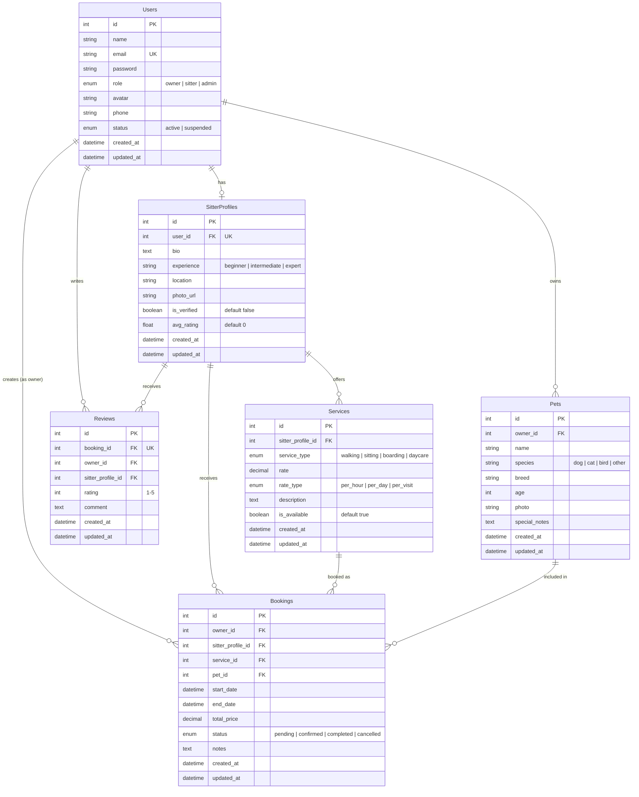

# PetMate 🐾 — Schema ERD

## Entity Relationship Diagram

---

## Table Details

### 1. Users

| Column       | Type         | Constraints              |
| ------------ | ------------ | ------------------------ |
| `id`         | INT          | PK, Auto Increment      |
| `name`       | VARCHAR(100) | NOT NULL                 |
| `email`      | VARCHAR(255) | NOT NULL, UNIQUE         |
| `password`   | VARCHAR(255) | NOT NULL (hashed)        |
| `role`       | ENUM         | `owner / sitter / admin` |
| `avatar`     | VARCHAR(255) | nullable                 |
| `phone`      | VARCHAR(20)  | nullable                 |
| `status`     | ENUM         | `active / suspended`     |
| `created_at` | TIMESTAMP    | DEFAULT NOW              |
| `updated_at` | TIMESTAMP    | DEFAULT NOW              |

---

### 2. Pets

| Column          | Type         | Constraints           |
| --------------- | ------------ | --------------------- |
| `id`            | INT          | PK, Auto Increment    |
| `owner_id`      | INT          | FK → Users(id)        |
| `name`          | VARCHAR(100) | NOT NULL              |
| `species`       | VARCHAR(50)  | dog / cat / bird etc. |
| `breed`         | VARCHAR(100) | nullable              |
| `age`           | INT          | nullable              |
| `photo`         | VARCHAR(255) | nullable              |
| `special_notes` | TEXT         | nullable              |
| `created_at`    | TIMESTAMP    | DEFAULT NOW           |
| `updated_at`    | TIMESTAMP    | DEFAULT NOW           |

---

### 3. SitterProfiles

| Column        | Type         | Constraints                   |
| ------------- | ------------ | ----------------------------- |
| `id`          | INT          | PK, Auto Increment            |
| `user_id`     | INT          | FK → Users(id), UNIQUE        |
| `bio`         | TEXT         | nullable                      |
| `experience`  | VARCHAR(50)  | beginner / intermediate / exp |
| `location`    | VARCHAR(255) | NOT NULL                      |
| `photo_url`   | VARCHAR(255) | nullable                      |
| `is_verified` | BOOLEAN      | DEFAULT false                 |
| `avg_rating`  | FLOAT        | DEFAULT 0                     |
| `created_at`  | TIMESTAMP    | DEFAULT NOW                   |
| `updated_at`  | TIMESTAMP    | DEFAULT NOW                   |

---

### 4. Services

| Column              | Type          | Constraints                       |
| ------------------- | ------------- | --------------------------------- |
| `id`                | INT           | PK, Auto Increment                |
| `sitter_profile_id` | INT           | FK → SitterProfiles(id)           |
| `service_type`      | ENUM          | walking / sitting / boarding / daycare |
| `rate`              | DECIMAL(10,2) | NOT NULL                          |
| `rate_type`         | ENUM          | per_hour / per_day / per_visit    |
| `description`       | TEXT          | nullable                          |
| `is_available`      | BOOLEAN       | DEFAULT true                      |
| `created_at`        | TIMESTAMP     | DEFAULT NOW                       |
| `updated_at`        | TIMESTAMP     | DEFAULT NOW                       |

---

### 5. Bookings

| Column              | Type          | Constraints                                 |
| ------------------- | ------------- | ------------------------------------------- |
| `id`                | INT           | PK, Auto Increment                          |
| `owner_id`          | INT           | FK → Users(id)                              |
| `sitter_profile_id` | INT           | FK → SitterProfiles(id)                     |
| `service_id`        | INT           | FK → Services(id)                           |
| `pet_id`            | INT           | FK → Pets(id)                               |
| `start_date`        | DATETIME      | NOT NULL                                    |
| `end_date`          | DATETIME      | NOT NULL                                    |
| `total_price`       | DECIMAL(10,2) | NOT NULL                                    |
| `status`            | ENUM          | pending / confirmed / completed / cancelled |
| `notes`             | TEXT          | nullable                                    |
| `created_at`        | TIMESTAMP     | DEFAULT NOW                                 |
| `updated_at`        | TIMESTAMP     | DEFAULT NOW                                 |

---

### 6. Reviews

| Column              | Type      | Constraints               |
| ------------------- | --------- | ------------------------- |
| `id`                | INT       | PK, Auto Increment        |
| `booking_id`        | INT       | FK → Bookings(id), UNIQUE |
| `owner_id`          | INT       | FK → Users(id)            |
| `sitter_profile_id` | INT       | FK → SitterProfiles(id)   |
| `rating`            | INT       | NOT NULL, CHECK 1–5       |
| `comment`           | TEXT      | nullable                  |
| `created_at`        | TIMESTAMP | DEFAULT NOW               |
| `updated_at`        | TIMESTAMP | DEFAULT NOW               |

---

## Relationships Summary

| Relationship                   | Type        | Description                                  |
| ------------------------------ | ----------- | -------------------------------------------- |
| Users → Pets                   | One-to-Many | An owner can have multiple pets               |
| Users → SitterProfiles         | One-to-One  | A sitter user has exactly one sitter profile  |
| SitterProfiles → Services      | One-to-Many | A sitter offers multiple services             |
| Users (owner) → Bookings       | One-to-Many | An owner can create multiple bookings         |
| SitterProfiles → Bookings      | One-to-Many | A sitter receives multiple bookings           |
| Services → Bookings            | One-to-Many | A service can be booked many times            |
| Pets → Bookings                | One-to-Many | A pet can be included in multiple bookings    |
| Bookings → Reviews             | One-to-One  | Each completed booking can have one review    |
| Users (owner) → Reviews        | One-to-Many | An owner can write multiple reviews           |
| SitterProfiles → Reviews       | One-to-Many | A sitter can receive multiple reviews         |
